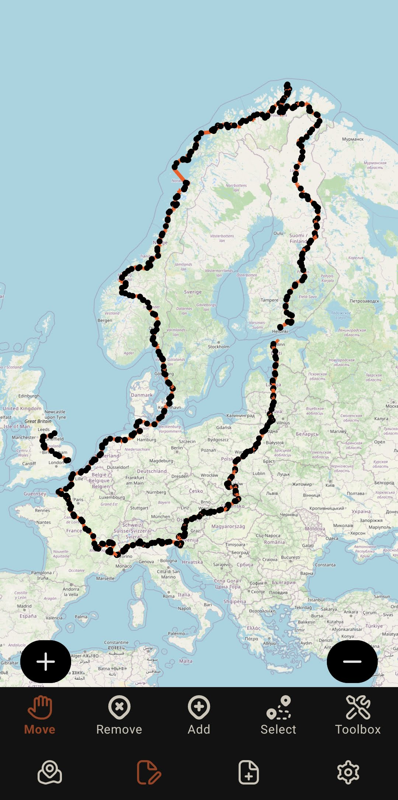
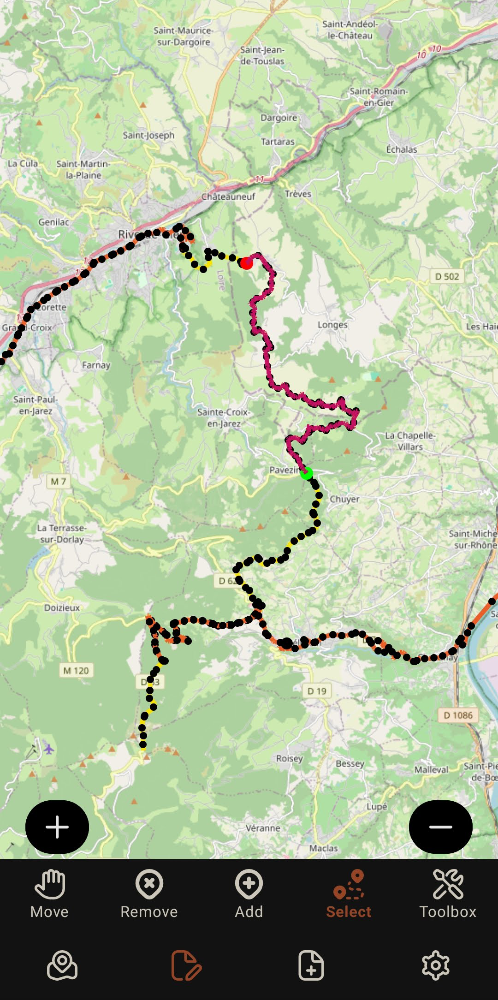
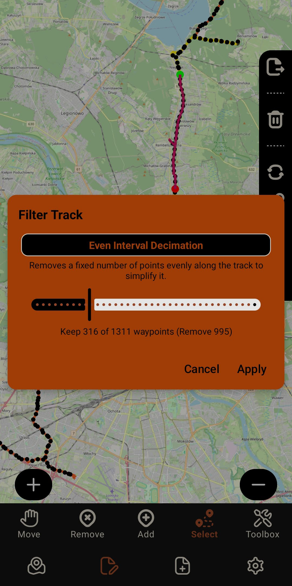
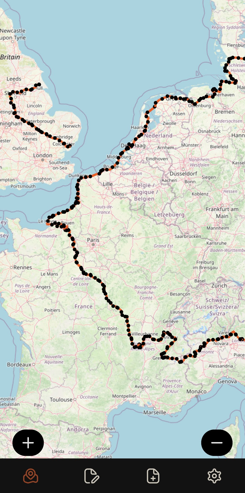
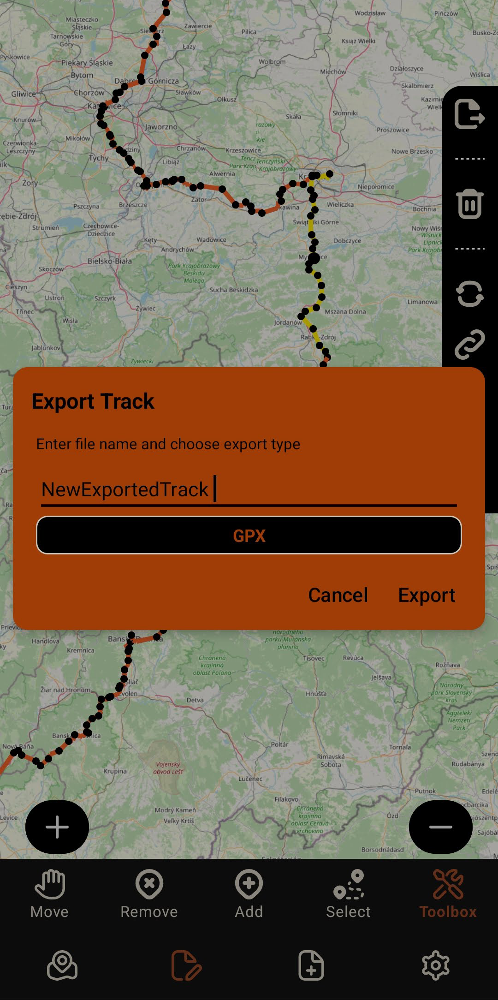

<!-- Improved compatibility of back to top link: See: https://github.com/othneildrew/Best-README-Template/pull/73 -->
<a id="readme-top"></a>
<!--
*** Thanks for checking out the Best-README-Template. If you have a suggestion
*** that would make this better, please fork the repo and create a pull request
*** or simply open an issue with the tag "enhancement".
*** Don't forget to give the project a star!
*** Thanks again! Now go create something AMAZING! :D
-->


<!-- PROJECT SHIELDS -->
<!--
*** I'm using markdown "reference style" links for readability.
*** Reference links are enclosed in brackets [ ] instead of parentheses ( ).
*** See the bottom of this document for the declaration of the reference variables
*** for contributors-url, forks-url, etc. This is an optional, concise syntax you may use.
*** https://www.markdownguide.org/basic-syntax/#reference-style-links
-->
[![Contributors][contributors-shield]][contributors-url]
[![Forks][forks-shield]][forks-url]
[![Stargazers][stars-shield]][stars-url]
[![Issues][issues-shield]][issues-url]
[![project_license][license-shield]][license-url]
[![LinkedIn][linkedin-shield]][linkedin-url]


<!-- PROJECT LOGO -->
<br />
<div align="center">
  <a href="https://github.com/OliverMineau/OpenTrackEditor">
    
  </a>

  <h3 align="center">OpenTrackEditor</h3>

  <p align="center">
  A multifunctional tool to help you manage your GPS files!
  <br />
  <a href="https://olivermineau.com/opentrackeditor"><strong>Learn more about the project »</strong></a>
  <br />
  <a href="https://github.com/OliverMineau/OpenTrackEditor"><strong>Explore the docs »</strong></a>
</p>

  <p align="center">
    <a href="https://play.google.com/store/apps/details?id=com.minapps.trackeditor">
      
    </a>
  </p>

[](https://play.google.com/store/apps/details?id=com.minapps.trackeditor)

    

  <p align="center">
    <a href="https://github.com/OliverMineau/OpenTrackEditor">View Demo</a>
    &middot;
    <a href="https://github.com/OliverMineau/OpenTrackEditor/issues/new?labels=bug&template=bug-report---.md">Report Bug</a>
    &middot;
    <a href="https://github.com/OliverMineau/OpenTrackEditor/issues/new?labels=enhancement&template=feature-request---.md">Request Feature</a>
  </p>
</div>


<!-- TABLE OF CONTENTS -->
<details>
  <summary>Table of Contents</summary>
  <ol>
    <li>
      <a href="#about-the-project">About The Project</a>
      <ul>
        <li><a href="#built-with">Built With</a></li>
      </ul>
    </li>
    <li>
      <a href="#getting-started">Getting Started</a>
      <ul>
        <li><a href="#prerequisites">Prerequisites</a></li>
        <li><a href="#installation">Installation</a></li>
      </ul>
    </li>
    <li><a href="#usage">Usage</a></li>
    <li><a href="#roadmap">Roadmap</a></li>
    <li><a href="#contributing">Contributing</a></li>
    <li><a href="#license">License</a></li>
    <li><a href="#contact">Contact</a></li>
    <li><a href="#acknowledgments">Acknowledgments</a></li>
  </ol>
</details>


<!-- ABOUT THE PROJECT -->
## About The Project

OpenTrackEditor started as a student project and has grown into an open-source Android tool thanks to all of your feedback. 

This tool will help you manage your GPS files with an intuitive UI. Think of it as **LibreOffice for GPX and KML files.**

Create your own tracks from scratch or load any .gpx or .kml file of any size into the app to begin the process. Tracks with millions of waypoints can be loaded and edited.


<p align="center">








</p>


The current implemented features are :
    
    
- **Edit tracks :**
  - Move
  - Add
  - Delete
  - Reverse tracks
  - Join tracks
  - **Filter tracks :**
    - **Even Interval Decimation :** Removes a fixed number of points evenly along the track to simplify it.
    - 🚧 **Many more filters to come**
  - 🚧 **Many more tools to come**
- **Import / Export / Convert :**
  - GPX
  - KML

<p align="right">(<a href="#readme-top">back to top</a>)</p>


### Built With

* [![Android][Android]][Android-url]
* [![Kotlin][Kotlin]][Kotlin-url]
* [![Gradle][Gradle]][Gradle-url]


<p align="right">(<a href="#readme-top">back to top</a>)</p>


<!-- GETTING STARTED -->
## Getting Started

Follow these steps to set up the project locally and run it on your device or emulator.

### Prerequisites

- [Android Studio](https://developer.android.com/studio) (latest stable version recommended)
- Android SDK (installed through Android Studio)
- A device or emulator running Android 7.0 (API 24) or higher

### Installation

1. Clone the repository
   ```sh
   git clone https://github.com/OliverMineau/OpenTrackEditor.git
   ```


<p align="right">(<a href="#readme-top">back to top</a>)</p>


<!-- USAGE EXAMPLES -->
## Usage

Here’s how to use OpenTrackEditor once installed :


- **Import a GPS file :** 
  - Select any .gpx or .kml files to import
  - Wait for it to import and process your track

- **View map :** 
  - View your tracks
  - All input is disabled

- **Edit track :** 
  - Open the editing navigation bar

- **Move waypoints:** 
  - Long press a waypoint and drag it to the desired position

- **Remove waypoint :** 
  - Click on a waypoint to delete it

- **Add waypoint :** 
  - If no track is selected :
    - Click anywhere on the map to add a waypoint and create a track.
  - If a track is selected :
    - Click on the end points of the track to add waypoints from that end.
    - Click on a waypoint in the middle of the track to add one besides it

- **Select tracks or segments :** 
  - Select tracks :
    - Click on the track itself to select it
  - Select a segment :
    - Click on a waypoint then click on a second waypoint of the same track

- **Toolbox :** 
  - Click to open the tool box. It contains all the other tools
  - When opened a menu will appear on the right of the screen. Click on the arrows  in that menu to show the name of each tool.

  - **Export tracks :** 
    - Select the tracks you want to export
    - Click the export tool, choose a name and the desired format 

  - **Delete tracks or segment :** 
    - Select tracks or segment
    - Click the delete tool to delete

  - **Reverse track or segment :** 
    - Select tracks or segment
    - Click the reverse tool to reverse

  - **Join tracks :** 
    - Select the endpoints of two different tracks 
    - Click the join tool to combine them making one track

  - **Filter track or segment :** 
    - Select track or segment
    - Click the filter tool
    - Choose which filter you want to apply


<p align="right">(<a href="#readme-top">back to top</a>)</p>


<!-- ROADMAP -->
## Roadmap

### In Progress / Planned Features

#### Core Features
- [ ] Edit track date/time and EXIF data
- [ ] Statistics per file (summary and graphs)
- [ ] Text editor mode for GPX files
- [ ] File fixer (repair broken GPX/KML files)
- [ ] Open GPX files with OTE as **track editor** or **text editor**
- [ ] Merge multiple segments into one track
- [ ] Cut tool
- [ ] Remove duplicate points
- [ ] Remove bugs (will use one of the filters) kind of short cut
- [ ] Reduce noise (will use one of the filters) kind of short cut
- [ ] Elevation view
- [ ] Screenshot export
- [ ] Map layers (satellite, topographic, etc.)
- [ ] Add Ramer–Douglas–Peucker filter : Removes points that don’t significantly change the shape of the track.
- [ ] Add Distance-Based filter : Keep only points that are a minimum distance apart.
- [ ] Add Moving Average filter : Smooths coordinates by averaging neighboring points.
- [ ] Add Kalman filter : Advanced filter that predicts and corrects positions based on motion.

#### Improvements
- [ ] Display track names when exporting
- [ ] Add info box (track + waypoint metadata)
- [ ] Error handling system with detailed error codes
- [ ] Extract timestamps from GPX and KML files

See the [open issues](https://github.com/OliverMineau/OpenTrackEditor/issues) for a full list of proposed features (and known issues).

<p align="right">(<a href="#readme-top">back to top</a>)</p>


<!-- CONTRIBUTING -->
## Contributing

Contributions are what make the open source community such an amazing place to learn, inspire, and create. Any contributions you make are **greatly appreciated**.

If you have a suggestion that would make this better, please fork the repo and create a pull request. You can also simply open an issue with the tag "enhancement".
Don't forget to give the project a star! Thanks again!

1. Fork the Project
2. Create your Feature Branch (`git checkout -b feature/AmazingFeature`)
3. Commit your Changes (`git commit -m 'Add some AmazingFeature'`)
4. Push to the Branch (`git push origin feature/AmazingFeature`)
5. Open a Pull Request

You can view the docs for more information on the project structure : [https://olivermineau.com/opentrackeditor](https://olivermineau.com/opentrackeditor)

<p align="right">(<a href="#readme-top">back to top</a>)</p>

### Top contributors:

<a href="https://github.com/OliverMineau/OpenTrackEditor/graphs/contributors">
  
</a>


<!-- LICENSE -->
## License

Distributed under the project_license. See `LICENSE.txt` for more information.

<p align="right">(<a href="#readme-top">back to top</a>)</p>


<!-- CONTACT -->
## Contact

Oliver Mineau - minapps.apps@gmail.com

Project Website: [https://olivermineau.com/opentrackeditor](https://olivermineau.com/opentrackeditor)


Project Link: [https://github.com/OliverMineau/OpenTrackEditor](https://github.com/OliverMineau/OpenTrackEditor)

<p align="right">(<a href="#readme-top">back to top</a>)</p>


<!-- MARKDOWN LINKS & IMAGES -->
<!-- https://www.markdownguide.org/basic-syntax/#reference-style-links -->
[contributors-shield]: https://img.shields.io/github/contributors/OliverMineau/OpenTrackEditor.svg?style=for-the-badge
[contributors-url]: https://github.com/OliverMineau/OpenTrackEditor/graphs/contributors
[forks-shield]: https://img.shields.io/github/forks/OliverMineau/OpenTrackEditor.svg?style=for-the-badge
[forks-url]: https://github.com/OliverMineau/OpenTrackEditor/network/members
[stars-shield]: https://img.shields.io/github/stars/OliverMineau/OpenTrackEditor.svg?style=for-the-badge
[stars-url]: https://github.com/OliverMineau/OpenTrackEditor/stargazers
[issues-shield]: https://img.shields.io/github/issues/OliverMineau/OpenTrackEditor.svg?style=for-the-badge
[issues-url]: https://github.com/OliverMineau/OpenTrackEditor/issues
[license-shield]: https://img.shields.io/github/license/OliverMineau/OpenTrackEditor.svg?style=for-the-badge
[license-url]: https://github.com/OliverMineau/OpenTrackEditor/blob/master/LICENSE.txt
[linkedin-shield]: https://img.shields.io/badge/-LinkedIn-black.svg?style=for-the-badge&logo=linkedin&colorB=555
[linkedin-url]: https://linkedin.com/in/oliver-mineau-b7a4861b2
[product-screenshot]: images/preview.png
[Next.js]: https://img.shields.io/badge/next.js-000000?style=for-the-badge&logo=nextdotjs&logoColor=white
[Next-url]: https://nextjs.org/
[React.js]: https://img.shields.io/badge/React-20232A?style=for-the-badge&logo=react&logoColor=61DAFB
[React-url]: https://reactjs.org/
[Vue.js]: https://img.shields.io/badge/Vue.js-35495E?style=for-the-badge&logo=vuedotjs&logoColor=4FC08D
[Vue-url]: https://vuejs.org/
[Angular.io]: https://img.shields.io/badge/Angular-DD0031?style=for-the-badge&logo=angular&logoColor=white
[Angular-url]: https://angular.io/
[Svelte.dev]: https://img.shields.io/badge/Svelte-4A4A55?style=for-the-badge&logo=svelte&logoColor=FF3E00
[Svelte-url]: https://svelte.dev/
[Laravel.com]: https://img.shields.io/badge/Laravel-FF2D20?style=for-the-badge&logo=laravel&logoColor=white
[Laravel-url]: https://laravel.com
[Bootstrap.com]: https://img.shields.io/badge/Bootstrap-563D7C?style=for-the-badge&logo=bootstrap&logoColor=white
[Bootstrap-url]: https://getbootstrap.com
[JQuery.com]: https://img.shields.io/badge/jQuery-0769AD?style=for-the-badge&logo=jquery&logoColor=white
[JQuery-url]: https://jquery.com 
[Android]: https://img.shields.io/badge/Android-3DDC84?style=for-the-badge&logo=android&logoColor=white
[Android-url]: https://developer.android.com/

[Kotlin]: https://img.shields.io/badge/Kotlin-0095D5?style=for-the-badge&logo=kotlin&logoColor=white
[Kotlin-url]: https://kotlinlang.org/

[Compose]: https://img.shields.io/badge/Jetpack%20Compose-4285F4?style=for-the-badge&logo=android&logoColor=white
[Compose-url]: https://developer.android.com/jetpack/compose

[Gradle]: https://img.shields.io/badge/Gradle-02303A?style=for-the-badge&logo=gradle&logoColor=white
[Gradle-url]: https://gradle.org/
